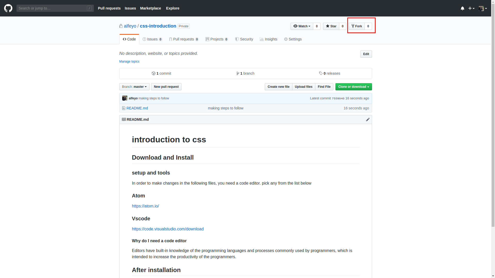

# **introduction to css**

## Download and Install

### setup and tools

In order to make changes in the following files, you need a code editor. pick any from the list below

### Atom
https://atom.io/

### Vscode
https://code.visualstudio.com/download

#### Why do I need a code editor

Editors have built-in knowledge of the programming languages and processes commonly used by programmers, which is intended to increase the productivity of the programmers.

##  After installation of the above. 

You will need to Fork the following Repos as your own

links for the following 

repos are 

git@github.com:BongoHive/css-introduction-2.git

git@github.com:BongoHive/css-introduction-2.git
git@github.com:BongoHive/css-introduction-3.git
git@github.com:BongoHive/css-introduction-4.git